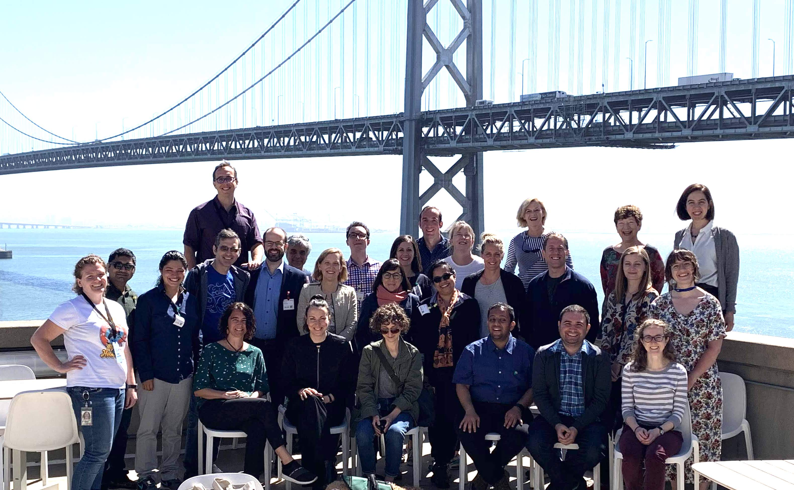

# Software Developer Diversity and Inclusion (SDDI) Workshop

Location: Google, San Francisco

June 4-6, 2019

Sponsored by Google, USA

### Organizers: 

[Emerson Murphy-Hill](https://ai.google/research/people/EmersonMurphyHill),  Google 

[Margaret-Anne Storey](http://margaretstorey.com/),  University of Victoria   

This workshop was organized to raise awareness about developer diversity and inclusion challenges faced by industry today. Our intent was to understand these challenges more clearly, to brainstorm concrete goals to address them, and to gather recommendations and best practices to share with practitioners.  We also aimed to build a community of researchers and practitioners that share a passion to improve software developer diversity and inclusion.  The workshop had a mix of invited keynote presentations and facilitator led discussions.  Below, you may find details on the [schedule](#schedule) with links to the keynotes, links for [lightning talks](#lightning-talks) and a list of the [workshop attendees](#attendees).  Stay tuned for more details of the workshop outcomes! 

### Schedule

---

| Date | Time | Topic/Link | Speaker/Leader | 
| ---- | ---- | ----- | ---------------| 
| Tuesday June 4th | 9:00-10:00 | [Minding the Gaps: Diversity and Inclusion](https://drive.google.com/file/d/1X0dT2bw7zvCU0_12c7mBRk5MCExWhRd-/view?usp=sharing) | Kate Stewart, The Linux Foundation  | 
| | 10:00-12:00 | Scoping the research area/Breakouts | Margaret Storey |
| | 13:00-14:00 | [Identifying Challenges Faced by Neurodiverse Software Engineers: Ensuring an Inclusive Technical Workforce](https://andrewbegel.com/papers/autism-at-work-sddi-workshop-begel.pdf) | Andrew Begel, Microsoft |
| | 14:00-16:00 | Breakouts | Andy Begel, Microsoft | 
| | 16:00-17:00| Organizer Intros + Lightning Talks (see links below) | |
| Wednesday, June 5th | 9:00-10:00 | [Identifying Developers’ Gender: State of the Art](https://www.slideshare.net/aserebrenik/identifying-developers-gender-state-of-the-art-148953605)| Alexander Serebrenik, Eindhoven University of Technology |
| | 10:00-12:00 | Breakouts | Anna Filipova, BigHub | 
| | 13:00-14:00 | [Improving Programming Environment Accessibility for Visually Impaired Developers](https://www.dropbox.com/sh/4ikx8gsv44lzm2a/AAAU4-bVVJjyifvdkVOrWzHya?dl=0) | Venkatesh Potluri, University of Washington |
| | 14:00-16:00 | Breakouts | Emerson Murphy=Hill | 
| | 16:00-17:00 | [Gender-Inclusivity Software Engineering](https://drive.google.com/file/d/1V0-JCmOarr2AZysjKcfWfi11BzGmrYth/view?usp=sharing) | Anita Sarma and Margaret Burnett, Oregon State University |
| Thursday, June 6th | 9:00-10:00 | [Leveraging Signals to Build More Sustainable Open Source Communities](https://cmustrudel.github.io/slides/google-sddi.pdf) | Bogdan Vasilescu, Carnegie Mellon University |
| | 10:00-12:00 | Breakouts | |
| | 13:00-14:00 | [Diversity in Computer Science Through Design & Craft: Femtech.dk & Atari Women](https://www.dropbox.com/s/67z4dqx9enyyi4f/PernilleBjornGoogleJune2019_3.pdf?dl=0) | Pernille Bjørn, University of Copenhagen | 
| | 14:00-16:00 | Breakouts | | 
| | 16:00-17:00 | Closing and next steps | |

### Lightning talks

[Ayushi Rastogi](https://www.slideshare.net/AyushiRastogi12/geographical-diversity-and-software-development)

[Amiangshu Bosu](https://drive.google.com/file/d/15kvBPuncI65iAPYeOUYRs1vWRJZRB1yq/view?usp=sharing)

[Jo Atlee](https://drive.google.com/file/d/1Vt1FFmqdvM6leFA2qgO5nqodUN_VcE4Y/view?usp=sharing) 

[Kelly Blincoe](https://drive.google.com/file/d/1u7EFQtEpUpgFjLFEeYBp7SOf7NhMrnY3/view?usp=sharing) 

[Vanja Tufvesson](https://docs.google.com/presentation/d/1wmdSj3a65RgOyTgFbxU4xqNnVrJitC51przgJMFnPSo/edit?usp=sharing) 

[Laura Dabbish](https://docs.google.com/presentation/d/1eOfzA7r7Y8ycFSqSlTRzYtyShQjgz0o7lg8uLJI3zLI/edit?usp=sharing) 

[Vladimir Filkov](https://drive.google.com/file/d/1MqEQ1HwDDbdeJuTMN1Xr9fCwmi1KCkb1/view?usp=sharing) 

[Valeria Borsotti](https://docs.google.com/presentation/d/11_QXJQzcb1Uiq-P4aCDqwrHdhtBRS2-Z-fL-G_IQ0UE/edit?usp=sharing) 

---

### Attendees 

---

| Name | Affiliation| 
| -------| ---------------| 
| [Jo Atlee](https://cs.uwaterloo.ca/~jmatlee/) | University of Waterloo, Canada| 
| [Alberto Bacchelli](https://sback.it) | University of Zurich, Switzerland |  
| [Andrew Begel](https://andrewbegel.com/) | Microsoft, USA |
| [Pernille Bjørn](http://www.circonflexe.dk/pernillebjorn/) | University of Copenhagen, Denmark | 
| [Kelly Blincoe](http://kblincoe.github.io) | University of Auckland, New Zealand |
| [Valeria Borsotti](https://pure.itu.dk/portal/en/persons/valeria-borsotti(d95ef042-b41c-46cf-b133-6b1d01cad170).html) | IT University of Copenhagen, Denmark | 
| [Amiangshu Bosu](http://amiangshu.com) | Wayne State University, USA| 
| [Margaret Burnett](http://web.engr.oregonstate.edu/~burnett/) | Oregon State, USA |
| Laura Dabbish| Carnegie Mellon University, USA |
| [Prem Devanbu](https://www.cs.ucdavis.edu/~devanbu) | UC Davis, USA |
| Jill Dicker | Google, USA |  
| Anna Filipova | GitHub, USA | 
| [Vladimir Filkov](https://web.cs.ucdavis.edu/~filkov/) | UC Davis, USA | 
| [Thomas Fritz](https://www.ifi.uzh.ch/en/seal/people/fritz.html)| University of Zurich, Switzerland | 
| Daniel German | University of Victoria, Canada |
| Amber Horvath | Google, USA |  
| Liz Kammer | Google, USA |
| Alice Merrick | Google, USA | 
| Ambar Murillo | Google, USA | 
| [Venkatesh Potluri](https://venkateshpotluri.me )| University of Washington, USA|
| [Ayushi Rastogi](https://ayushirastogi.github.io/) | TU Delft, The Netherlands | 
| [Ita Richardson](https://ulris3.ul.ie/live/!W_VA_CV_BUILDER.POPUP?LAYOUT=Y&USER=ita.richardson%40lero.ie) | University of Limerick, Ireland | 
| [Anita Sarma](http://web.engr.oregonstate.edu/~sarmaa/) | Oregon State, USA | 
| [Alexander Serebrenik](http://www.win.tue.nl/~aserebre/) | TU Eindhoven, The Netherlands | 
| Kate Stewart | Linux Foundation, USA | 
| [Vanja Tufvesson](https://www.pinkprogramming.se/en/ ) |  Pink Programming, Sweden | 
| [Bogdan Vasilescu](https://cmustrudel.github.io/) |  CMU, USA |
| Jeff Warshaw | Google, USA |

---

